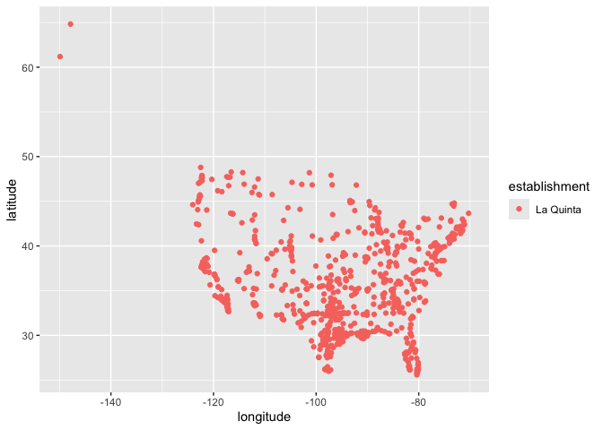

Lab 04 - Visualizing spatial data
================
Allison

### Load packages and data

``` r
##install.packages("devtools")
##devtools::install_github("rstudio-education/dsbox")
library(tidyverse)
library(dsbox)
```

``` r
states <- read_csv("data/states.csv")
```

### Exercise 1

``` r
print(dennys)
```

    ## # A tibble: 1,643 × 6
    ##    address                        city            state zip   longitude latitude
    ##    <chr>                          <chr>           <chr> <chr>     <dbl>    <dbl>
    ##  1 2900 Denali                    Anchorage       AK    99503    -150.      61.2
    ##  2 3850 Debarr Road               Anchorage       AK    99508    -150.      61.2
    ##  3 1929 Airport Way               Fairbanks       AK    99701    -148.      64.8
    ##  4 230 Connector Dr               Auburn          AL    36849     -85.5     32.6
    ##  5 224 Daniel Payne Drive N       Birmingham      AL    35207     -86.8     33.6
    ##  6 900 16th St S, Commons on Gree Birmingham      AL    35294     -86.8     33.5
    ##  7 5931 Alabama Highway, #157     Cullman         AL    35056     -86.9     34.2
    ##  8 2190 Ross Clark Circle         Dothan          AL    36301     -85.4     31.2
    ##  9 900 Tyson Rd                   Hope Hull (Tys… AL    36043     -86.4     32.2
    ## 10 4874 University Drive          Huntsville      AL    35816     -86.7     34.7
    ## # ℹ 1,633 more rows

There are 1643 observations and 6 variables in the dataset. Each row in
the dennys dataset represents a Denny’s restaurant at different places.
Each column represents one type of information about the location of the
store, including the state, the city, the store specific location, ZIP
code, the longitude, and latitude.

### Exercise 2

``` r
print(laquinta)
```

    ## # A tibble: 909 × 6
    ##    address                          city          state zip   longitude latitude
    ##    <chr>                            <chr>         <chr> <chr>     <dbl>    <dbl>
    ##  1 793 W. Bel Air Avenue            "\nAberdeen"  MD    21001     -76.2     39.5
    ##  2 3018 CatClaw Dr                  "\nAbilene"   TX    79606     -99.8     32.4
    ##  3 3501 West Lake Rd                "\nAbilene"   TX    79601     -99.7     32.5
    ##  4 184 North Point Way              "\nAcworth"   GA    30102     -84.7     34.1
    ##  5 2828 East Arlington Street       "\nAda"       OK    74820     -96.6     34.8
    ##  6 14925 Landmark Blvd              "\nAddison"   TX    75254     -96.8     33.0
    ##  7 Carretera Panamericana Sur KM 12 "\nAguascali… AG    20345    -102.      21.8
    ##  8 909 East Frontage Rd             "\nAlamo"     TX    78516     -98.1     26.2
    ##  9 2116 Yale Blvd Southeast         "\nAlbuquerq… NM    87106    -107.      35.1
    ## 10 7439 Pan American Fwy Northeast  "\nAlbuquerq… NM    87109    -107.      35.2
    ## # ℹ 899 more rows

There are 909 observations and 6 variables in this dataset. Each row in
the La Quinta’s dataset represents a La Quinta hotel at different
places. Each column represents one type of information about the
location of the store, including the state, the city, the store specific
location, ZIP code, the longitude, and latitude.

### Exercise 3

On the website of Denny’s it shows that the restaurant is opened in 15
countries besides USA, including: Canada, Puerto Rico, Guam, Mexico,
Honduras, Costa Rica, Guatemala, El Salvador, The Philippines,
Indonesia, New Zealand, The United Arab Emirates, The United Kingdom,
Japan. For La Quinta’s, the hotel is opened in 9 countries besides USA,
including: Ecuador, Colombia, Chile, United Arab Emirates, Turkey, New
Zealand, China, Mexico, Canada.

### Exercise 4

if possible, we can create a new variable and filter the original state
column into the new variable. The state abbreviations for the 50 states
will be filtered as “US”, while any other labels will be “others”. In
this way we can know how many of the stores are outside USA.

### Exercise 5

``` r
dn <- dennys %>% 
  filter(!(state %in% states$abbreviation))
```

For Denny’s, it appears that the dataset did not include any store that
is outside of the US.

### Exercise 6

``` r
dennys %>%
  mutate(country = "United States")
```

    ## # A tibble: 1,643 × 7
    ##    address                        city    state zip   longitude latitude country
    ##    <chr>                          <chr>   <chr> <chr>     <dbl>    <dbl> <chr>  
    ##  1 2900 Denali                    Anchor… AK    99503    -150.      61.2 United…
    ##  2 3850 Debarr Road               Anchor… AK    99508    -150.      61.2 United…
    ##  3 1929 Airport Way               Fairba… AK    99701    -148.      64.8 United…
    ##  4 230 Connector Dr               Auburn  AL    36849     -85.5     32.6 United…
    ##  5 224 Daniel Payne Drive N       Birmin… AL    35207     -86.8     33.6 United…
    ##  6 900 16th St S, Commons on Gree Birmin… AL    35294     -86.8     33.5 United…
    ##  7 5931 Alabama Highway, #157     Cullman AL    35056     -86.9     34.2 United…
    ##  8 2190 Ross Clark Circle         Dothan  AL    36301     -85.4     31.2 United…
    ##  9 900 Tyson Rd                   Hope H… AL    36043     -86.4     32.2 United…
    ## 10 4874 University Drive          Huntsv… AL    35816     -86.7     34.7 United…
    ## # ℹ 1,633 more rows

``` r
print(dn)
```

    ## # A tibble: 0 × 6
    ## # ℹ 6 variables: address <chr>, city <chr>, state <chr>, zip <chr>,
    ## #   longitude <dbl>, latitude <dbl>

### Exercise 7

``` r
lq <- laquinta %>% 
  filter(!(state %in% states$abbreviation))
print(lq)
```

    ## # A tibble: 14 × 6
    ##    address                                  city  state zip   longitude latitude
    ##    <chr>                                    <chr> <chr> <chr>     <dbl>    <dbl>
    ##  1 Carretera Panamericana Sur KM 12         "\nA… AG    20345    -102.     21.8 
    ##  2 Av. Tulum Mza. 14 S.M. 4 Lote 2          "\nC… QR    77500     -86.8    21.2 
    ##  3 Ejercito Nacional 8211                   "Col… CH    32528    -106.     31.7 
    ##  4 Blvd. Aeropuerto 4001                    "Par… NL    66600    -100.     25.8 
    ##  5 Carrera 38 # 26-13 Avenida las Palmas c… "\nM… ANT   0500…     -75.6     6.22
    ##  6 AV. PINO SUAREZ No. 1001                 "Col… NL    64000    -100.     25.7 
    ##  7 Av. Fidel Velazquez #3000 Col. Central   "\nM… NL    64190    -100.     25.7 
    ##  8 63 King Street East                      "\nO… ON    L1H1…     -78.9    43.9 
    ##  9 Calle Las Torres-1 Colonia Reforma       "\nP… VE    93210     -97.4    20.6 
    ## 10 Blvd. Audi N. 3 Ciudad Modelo            "\nS… PU    75010     -97.8    19.2 
    ## 11 Ave. Zeta del Cochero No 407             "Col… PU    72810     -98.2    19.0 
    ## 12 Av. Benito Juarez 1230 B (Carretera 57)… "\nS… SL    78399    -101.     22.1 
    ## 13 Blvd. Fuerza Armadas                     "con… FM    11101     -87.2    14.1 
    ## 14 8640 Alexandra Rd                        "\nR… BC    V6X1…    -123.     49.2

According to the dataset, there are 14 stores outside of the US.
According to the websites, the hotel is opened in 9 countries besides
USA, including: Ecuador, Colombia, Chile, United Arab Emirates, Turkey,
New Zealand, China, Mexico, Canada.

### Exercise 8

``` r
laquinta <- laquinta %>%
  mutate(country = case_when(
    state %in% state.abb ~ "United States",
    state %in% c("ON", "BC") ~ "Canada",
    state == "ANT" ~ "Colombia",
    state %in% c("AG", "QR", "CH", "NL", "VE", "PU", "SL") ~ "Mexico",
    state == "FM" ~ "Honduras"
  ))

lqf <- laquinta %>%
  filter(country == "United States")
```

### Exercise 9

``` r
dn %>%
  count(state) %>%
  inner_join(states, by = c("state" = "abbreviation"))
```

    ## # A tibble: 0 × 4
    ## # ℹ 4 variables: state <chr>, n <int>, name <chr>, area <dbl>

``` r
lqf %>%
  count(state) %>%
  inner_join(states, by = c("state" = "abbreviation"))
```

    ## # A tibble: 48 × 4
    ##    state     n name           area
    ##    <chr> <int> <chr>         <dbl>
    ##  1 AK        2 Alaska      665384.
    ##  2 AL       16 Alabama      52420.
    ##  3 AR       13 Arkansas     53179.
    ##  4 AZ       18 Arizona     113990.
    ##  5 CA       56 California  163695.
    ##  6 CO       27 Colorado    104094.
    ##  7 CT        6 Connecticut   5543.
    ##  8 FL       74 Florida      65758.
    ##  9 GA       41 Georgia      59425.
    ## 10 IA        4 Iowa         56273.
    ## # ℹ 38 more rows

Based on the dataset, California has the most Dennys’ stores (n = 403)
and Delaware has the least store (n = 1). This is not surprising since
Dennys started in California. As for La Quinta hotel, Texas has the most
La Quinta hotels (n = 237) and Maine has the least hotel (n = 1). The
internet said that La Quinta started in Texas.

### Exercise 10

``` r
dn <- dn %>%
  mutate(establishment = "Denny's")
lqf <- lqf %>%
  mutate(establishment = "La Quinta")
dn_lq <- bind_rows(dn, lqf)

ggplot(dn_lq, mapping = aes(
  x = longitude,
  y = latitude,
  color = establishment
)) +
  geom_point()
```

<!-- -->

### Exercise 11

``` r
dn_lq_nc <- dn_lq %>%
  filter(state == "NC")
  
ggplot(dn_lq_nc, mapping = aes(
  x = longitude,
  y = latitude,
  color = establishment
)) +
  geom_point(alpha = .5) +
  labs(
    title= "North Carolina Denny's and La Quinta Locations",
    x = "Longitude", 
    y = "Latitude"
    )
```

<!-- -->

According to the graph, it appears that most of the La Quinta hotels
have at least one Denny’s restaurant nearby. Therefore I agree with the
joke.

### Exercise 11

``` r
dn_lq_tx <- dn_lq %>%
  filter(state == "TX")
  
ggplot(dn_lq_tx, mapping = aes(
  x = longitude,
  y = latitude,
  color = establishment
)) +
  geom_point(alpha = .4) +
  labs(
    title= "Texas Denny's and La Quinta Locations",
    x = "Longitude", 
    y = "Latitude"
    )
```

<!-- -->

According to the graph, it appears that most of the La Quinta hotels
have at least one Denny’s restaurant nearby in Texas. However, since
there is more La Quinta hotels than Denny’s, the joke is less supported.
